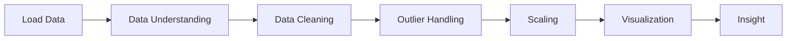

# 📊 Analisis Data Student Performance


---

## 🚀 Deskripsi
Proyek ini berfokus pada eksplorasi dan visualisasi dataset **StudentsPerformance.csv** untuk memahami pola nilai siswa serta hubungan antar variabel penting seperti gender, jenis lunch, dan pendidikan orang tua.

---

## 📂 Informasi Dataset
Dataset mencakup beberapa fitur utama:
- 🎓 Gender
- 🌍 Race/Ethnicity
- 👨‍👩‍👧 Pendidikan Orang Tua
- 🍽️ Jenis Lunch
- 📘 Test Preparation Course
- ➕ Math Score
- 📖 Reading Score
- ✍️ Writing Score

---

## ⚙️ Workflow Analisis



---

## 📊 Visualisasi yang Digunakan
- 📌 Distribusi Gender
- 📌 Histogram Math Score
- 📌 Violin Plot Writing Score
- 📌 Boxplot Math Score vs Lunch
- 📌 Scatter Plot Reading vs Writing
- 📌 Heatmap Korelasi
- 📌 Rata-rata Score vs Pendidikan Orang Tua

---

## 🔍 Insight Utama
- 📊 Jumlah siswa laki-laki dan perempuan relatif seimbang.
- 📈 Nilai matematika mayoritas berada pada rentang menengah.
- 👩‍🎓 Terdapat perbedaan distribusi nilai writing berdasarkan gender.
- 🍽️ Jenis lunch berpengaruh terhadap performa nilai matematika.
- 🔗 Reading dan writing score memiliki hubungan positif.
- 🔥 Ketiga skor akademik memiliki korelasi yang kuat.
- 👨‍👩‍👧 Pendidikan orang tua berkontribusi terhadap hasil belajar siswa.

---

## 🛠️ Teknologi
```bash
Python
Pandas
NumPy
Matplotlib
Seaborn
Scikit-learn
```

---

## ▶️ Cara Menjalankan
```bash
pip install pandas numpy matplotlib seaborn scikit-learn
```

Kemudian jalankan file:
```bash
jupyter notebook
```

Pastikan dataset berada dalam folder yang sama.

---

## 📌 Catatan
Proyek ini dibuat untuk praktikum **Applied Machine Learning** sebagai latihan eksplorasi data dan visualisasi.

---

## 👨‍💻 Author
**Muhammad Rizal Haris**  
NIM: 105841103223
