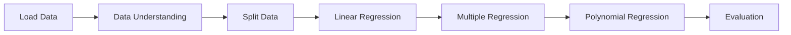

# 📊 Pertemuan 3 - Linear & Polynomial Regression


---

## 🚀 Deskripsi
Pada pertemuan ini dilakukan analisis regresi untuk memprediksi nilai ujian siswa berdasarkan beberapa faktor seperti jam belajar, kehadiran, dan waktu tidur.  
Model yang digunakan meliputi **Simple Linear Regression**, **Multiple Linear Regression**, dan **Polynomial Regression**.

---

## 📂 Dataset
Dataset yang digunakan: **StudentPerformanceFactors.csv**

Fitur utama:
- Hours_Studied
- Attendance
- Sleep_Hours
- Exam_Score (target)

---

## ⚙️ Tahapan Analisis



---

## 📈 Model yang Digunakan

### 1. Simple Linear Regression
Menggunakan satu variabel input:
- Hours_Studied → Exam_Score

### 2. Multiple Linear Regression
Menggunakan beberapa variabel:
- Hours_Studied
- Attendance
- Sleep_Hours

### 3. Polynomial Regression
- Mengubah fitur menjadi bentuk polynomial (degree = 2)
- Digunakan untuk menangkap pola non-linear

---

## 📊 Evaluasi Model

Model dievaluasi menggunakan:

- **MAE (Mean Absolute Error)** → Mengukur rata-rata kesalahan absolut
- **RMSE (Root Mean Squared Error)** → Memberi penalti lebih besar pada error besar
- **R² Score** → Mengukur seberapa baik model menjelaskan data

---

## 🔍 Insight

- Model multiple regression memberikan hasil lebih baik dibanding simple regression.
- Penambahan variabel membantu meningkatkan akurasi model.
- Polynomial regression mampu menangkap pola non-linear dalam data.
- Nilai R² menunjukkan bahwa model cukup mampu menjelaskan hubungan antar variabel.

---

## 🛠️ Teknologi

```bash
Python
Pandas
NumPy
Matplotlib
Scikit-learn
```

---

## ▶️ Cara Menjalankan

```bash
pip install pandas numpy matplotlib scikit-learn
```

Jalankan:
```bash
jupyter notebook
```

---

## 👨‍💻 Author

**Muhammad Rizal Haris**  
NIM: 105841103223
